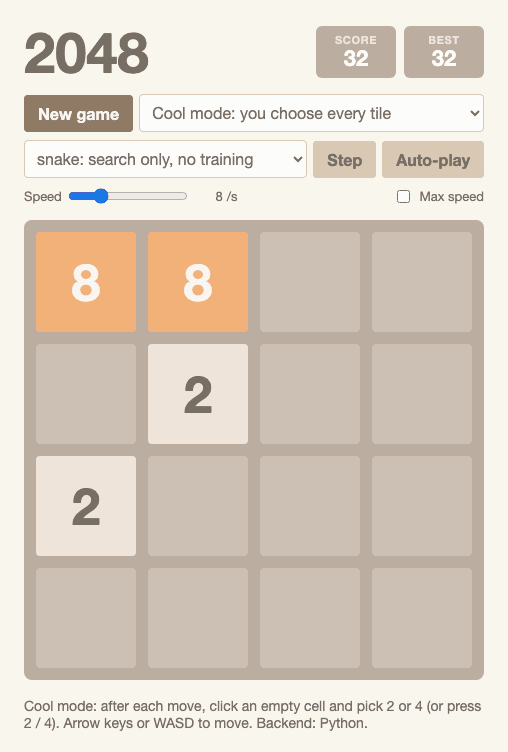
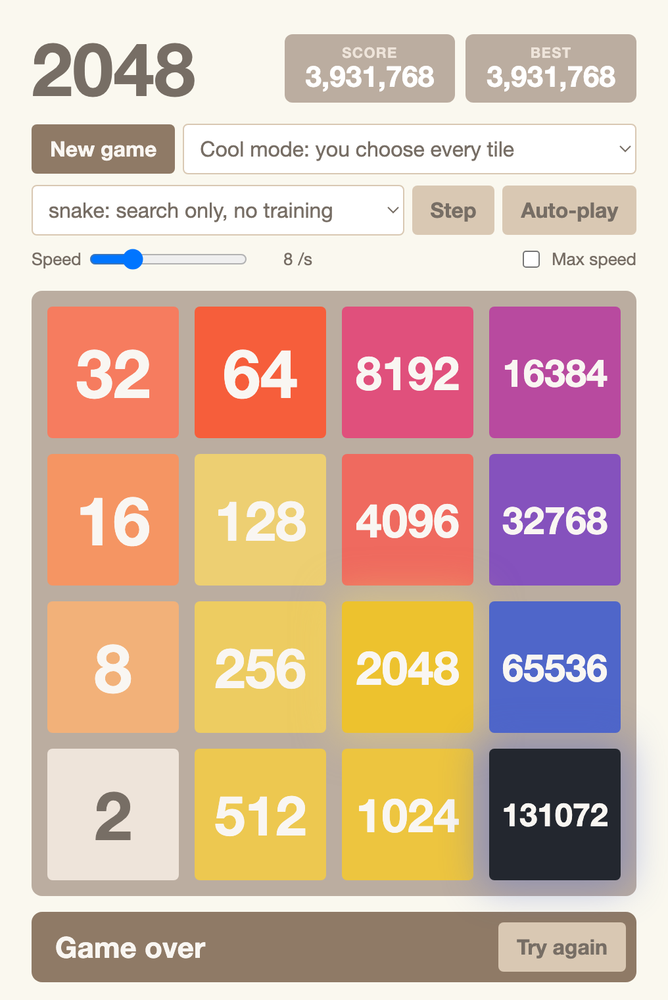
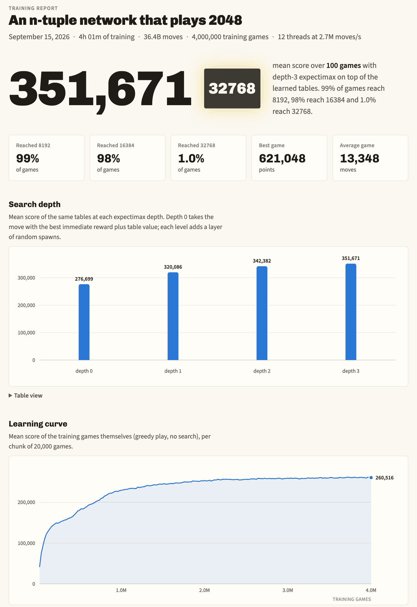

# 2048-rl

[](https://github.com/LoganBradley787/2048-rl/actions/workflows/tests.yml)

AI players for 2048, written from scratch: the game, a C engine that learns
it by playing against itself, the searches that go with it, and a web page
where you can watch them or play yourself.

Two results:

- **The normal game.** A network of lookup tables trained by self-play
  averages **351,671 points** and reaches the 16384 tile in 98% of games. It
  started from nothing, with no human games and no built-in strategy, and
  trained for 4 hours on a laptop.
- **Cool mode**, a variant where you also choose where each new tile goes. A
  search with one hand-written rule and no training builds the **131072**
  tile, the largest a 4x4 board can hold, and scores **3,931,768**. The upper
  bound is 3,932,164.

For scale: a person who reaches the 2048 tile once has about 20,000 points.



*The `snake` agent playing one cool-mode game from the first tile to the
last: 130,969 moves, about four minutes in real time. The last frame is as
full as a board gets: one of every tile from 131072 down to 8, and a final 2.*

## Try it

You need Python 3.10 or newer, [uv](https://docs.astral.sh/uv/), and a C
compiler (`cc`), on macOS or Linux.

```bash
git clone https://github.com/LoganBradley787/2048-rl.git
cd 2048-rl
uv sync
uv run uvicorn game2048.server:app --port 8048
```

Open http://localhost:8048. Then:

1. **Play.** Arrow keys or WASD, or swipe on a phone.
2. **Watch the game in the animation above.** Set the tile mode to
   *Cool mode*, leave the player on *snake*, tick **Max speed**, and press
   **Auto-play**.
3. **Lose quickly.** Set the tile mode to *Evil tiles*, where every new tile
   lands where it hurts most.

The `snake`, `greedy` and `random` players work on a fresh clone. `ntuple`,
`ntuple-cool` and `nn` need trained weights, which are not in the repository
(the tables are 0.5 GB and up). [Train your own](#train-your-own) takes one
command.

Without uv, `pip install -e .` and
`python -m uvicorn game2048.server:app --port 8048` do the same thing.

## The players

| Player | What it is | Normal game, mean score | Biggest tile |
| --- | --- | --- | --- |
| `random` | random legal moves | 1,099 | 256 at best |
| `greedy` | takes the biggest merge on offer | 3,180 | 512 at best |
| `nn` | small convolutional network, 46 minutes of training in PyTorch | 29,869 | 2048 in 74% of games |
| `snake` | search with one hand-written rule, no training | 66,199 | 2048 in every game, 8192 in 12% |
| `ntuple` | lookup tables trained by self-play in C, plus a 3-level search | **351,671** | 16384 in 98% of games, 32768 in 1% |

In cool mode:

| Player | Score | Biggest tile |
| --- | --- | --- |
| `ntuple-cool`: tables trained on cool mode for 4 hours, plus a search | 1,528,428 | 65536 |
| `snake` | **3,931,768** | **131072** |

Every number comes from a run of this code. The details are under
[Results](#results).

## How it works

### Learning what a board is worth

After you move and before the new tile appears, the board is in an
*afterstate*. Each learning player holds a function V that estimates how many
more points a game will earn from a given afterstate. Playing is then simple:
try the four moves and take the one with the highest total of points from the
move plus V of the board it leaves behind.

Learning is almost as simple. Play a game by that rule, and after every move
nudge V of the previous afterstate toward the points just earned plus V of
the new afterstate. When the game ends, nudge the last one toward zero. This
is temporal-difference learning, TD(0) for short. V starts at zero
everywhere. Nobody tells the player to keep its big tile in a corner. It
finds that out from its own games.

### Lookup tables instead of a neural network

V has to be stored somehow. The `nn` player uses a small convolutional
network. The stronger choice for 2048 is plainer: an *n-tuple network*, which
is a set of lookup tables.

Pick 6 cells of the board. Their contents, 18 possibilities each (empty, 2,
4, up to 131072), form an index into a table of 18^6 = 34 million weights. V
is the sum of those lookups over 8 such patterns, each read under the 8
rotations and reflections of the board. That is 64 additions per board and
272 million weights.

Because it is only additions, it is fast, and
[`game2048/native/ntuple.c`](game2048/native/ntuple.c) is built around that.
A board is one 128-bit integer with five bits per cell. A move is four table
lookups. Training threads all write to the same tables without locks. Each
weight has its own learning rate that falls as its updates start to cancel
out (temporal coherence learning). The 8-pattern run in the table played 36
billion moves in 4 hours on 12 threads of an M3 Pro, about 2.7 million a
second, and the 4-pattern run went more than twice as fast.

Python drives the C library through `ctypes`, and the library compiles itself
with the system compiler the first time it is used.

### Looking ahead

A trained V plays well alone and better with search. *Expectimax* tries each
move, then every tile that could appear (a 2 nine times in ten, a 4
otherwise, in each empty cell), then each reply, three levels deep, with V at
the leaves. It averages over the tiles instead of assuming the worst. That
takes the 8-pattern network from 276,699 points with no search to 351,671, at
about 8 ms per move.

### Cool mode

When you place the tiles yourself there is no luck left, and the game becomes
a puzzle. Every point comes from a merge, so a finished game's score is fixed
by its final board and by how many of the placed tiles were 4s (a placed 4
skips the 2+2 merge that would have paid 4 points). No final board beats one
of every tile from 131072 down to 4, which caps the score at 3,932,164.

The `snake` agent gets within 396 of that with a beam search: keep the 128
most promising lines of play, extend each by one move and one placement,
repeat 16 times, play the first 4 steps of the best line, and plan again. A
line is ranked by the points it earned plus one hand-written term that
rewards tiles laid out in descending order along a snake-shaped path, so that
each merge sets up the next. It places 2s unless only a 4 keeps the game
alive, which happens 98 times in 131,000 moves.

The learned tables are not involved. Tables trained on cool mode did worse
than no tables at all. [docs/COOL_MODE.md](docs/COOL_MODE.md) has the whole
story, including where the 396 points went.



## Results

Normal game. The baselines and the CNN played 500 games each (seeds from
999). The n-tuple networks played the same 100 games at each search depth
(seed 2024). Depth counts the layers of random tiles searched, so depth 0 is
no search. The `snake` figures in the table above are from 24 games.

| Player | Mean score | Median | Best game | Reach 2048 | Reach 16384 | Reach 32768 |
| --- | --- | --- | --- | --- | --- | --- |
| Random moves | 1,099 | | 3,124 | 0% | | |
| Greedy | 3,180 | | 8,456 | 0% | | |
| CNN | 23,392 | 23,236 | 70,536 | 57.2% | | |
| CNN, averaged over the 8 board symmetries (`nn`) | 29,869 | 30,984 | 76,532 | 73.6% | | |
| 4 patterns, 2 h of training, depth 0 | 241,803 | 270,258 | 372,332 | 99% | 61% | 0% |
| 4 patterns, depth 3 | 345,675 | 363,168 | 385,588 | 100% | 97% | 0% |
| 8 patterns, 4 h of training, depth 0 | 276,699 | 290,356 | 375,016 | 100% | 75% | 0% |
| 8 patterns, depth 2 | 342,382 | 362,248 | 528,284 | 100% | 93% | 1% |
| **8 patterns, depth 3 (`ntuple`)** | **351,671** | **365,754** | **621,048** | 100% | 98% | 1% |



*Part of the report page that `python -m game2048.report --ntuple` builds
from a training log, here for the 8-pattern run.*

This is a strong player and not the state of the art. The best published
n-tuple players average about 600,000 and reach 32768 in most games
(Jaśkowski, 2017). The 4-pattern tables here top out near 385,000, roughly
where a game ends if it holds a 16384 and an 8192 and never merges two
16384s. The 8-pattern tables manage that merge once in a hundred games.

## What did not work

- **The CNN.** It was the first learner and it stalled at 2048 in 74% of
  games. The tables passed it within the first minute of training.
- **Multi-stage tables.** Giving late-game boards their own tables is the
  idea behind the best published results. A 3-stage run seeded from the
  4-pattern tables scored 313,338 at depth 2, below the single-stage tables,
  and was dropped.
- **Learning cool mode.** Tables trained for 4 hours on the choose game
  reached 65536. The search with no tables reached 131072.
- **Charging 4s their cost in the search ranking.** That game died at 65536.
  Planning with 2s first and falling back to 4s is what worked.
- **A bonus for empty cells** in the snake player's random-tile search. It
  was worse at every weight tried.

## Train your own

The trained weights are not in the repository: one set of n-tuple tables is
0.5 to 3 GB, far past what git is for. The players that need them are a
command away instead.

```bash
uv run python -m game2048.ntuple_train --hours 0.2 --threads 8
```

That is 12 minutes. It writes `checkpoints/ntuple/weights.bin`, and the
`ntuple` player in the web UI picks it up. A short run goes a long way: after
140,000 games (ten minutes on a laptop that was busy with other jobs) the
tables averaged 201,797 points over 48 games with a 2-level search and
reached 8192 in 96% of them. The 2-hour and 4-hour runs in the table are the
same command with `--hours 2`, and with `--hours 4 --patterns 8x6`.

The `nn` player needs PyTorch and a run of its own:

```bash
uv sync --extra train
uv run python -m game2048.train --minutes 30
```

[docs/TRAINING.md](docs/TRAINING.md) covers the flags, the tables for
`ntuple-cool`, and the report page with the learning curves.

## What is in the repo

| Path | What it is |
| --- | --- |
| `game2048/core.py` | The rules. `Game` holds the board and score. No dependencies. |
| `game2048/native/ntuple.c` | The C engine: bitboards, the n-tuple network, TD learning, expectimax and beam search, multithreaded. |
| `game2048/ntuple.py` | The `ctypes` wrapper around it, and the `ntuple` and `snake` agents. |
| `game2048/ntuple_train.py` | Training command for the n-tuple network. |
| `game2048/server.py`, `static/` | FastAPI server and the browser UI (plain HTML, CSS and JS). |
| `game2048/env.py`, `game2048/vec_env.py` | `reset()` / `step()` environment, and a numpy engine for many boards at once. |
| `game2048/nn.py`, `game2048/train.py` | The CNN baseline and its trainer (PyTorch, optional). |
| `game2048/agents.py` | The player registry. Add your own with an `act(game)` method. |
| `game2048/report.py` | Builds an HTML report from a training log. |
| `examples/` | Evaluation and rollout scripts. |
| `tests/` | The test suite. |

[docs/USAGE.md](docs/USAGE.md) has the Python API, the HTTP API, the tile
modes, and how to plug in your own agent.

## Tests

```bash
uv sync --extra dev
uv run pytest
```

About three minutes. The C code is checked against plain Python versions of
the same logic: the move rules against `core.py`, and expectimax, the cool-mode
tree and the beam search against small reference implementations in the
tests. The CNN tests are skipped unless PyTorch is installed
(`uv sync --extra dev --extra train`).

## References

- M. Szubert and W. Jaśkowski, "Temporal Difference Learning of N-Tuple
  Networks for the Game 2048", IEEE CIG 2014. Afterstate TD learning with
  n-tuple networks.
- K.-H. Yeh, I-C. Wu, C.-H. Hsueh, C.-C. Chang, C.-C. Liang and H. Chiang,
  "Multi-Stage Temporal Difference Learning for 2048-like Games", 2016. The
  6-cell patterns and the stages.
- W. Jaśkowski, "Mastering 2048 with Delayed Temporal Coherence Learning,
  Multi-Stage Weight Promotion, Redundant Encoding and Carousel Shaping",
  2017. Temporal coherence learning and weight promotion.

## License

MIT. See [LICENSE](LICENSE).
